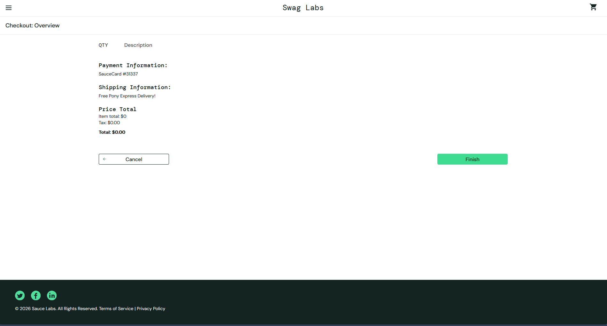
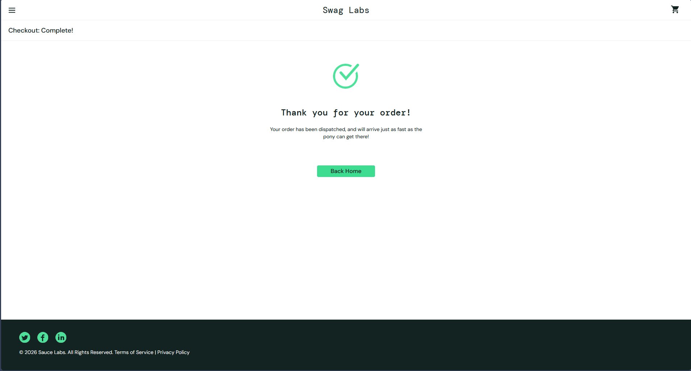
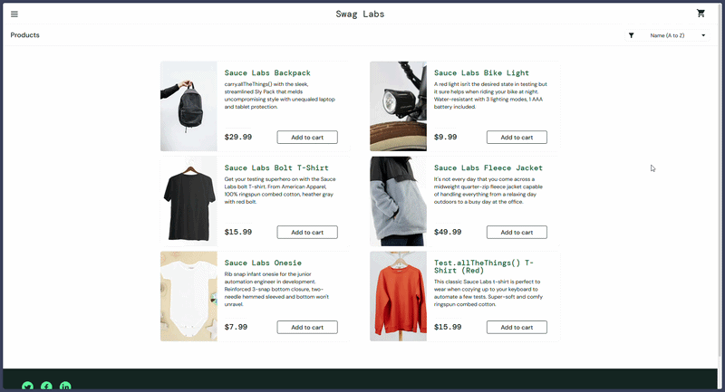

# 🧪 Testes Manuais - Swag Labs

## 📌 Sobre o projeto

Este projeto foi desenvolvido com o objetivo de praticar testes manuais em uma aplicação web de e-commerce, simulando o comportamento real de um QA em um fluxo crítico de negócio.

Os testes foram realizados no sistema Swag Labs, com foco na jornada de compra do usuário.

---

## 🎯 Escopo dos testes

Foram testados os principais módulos da aplicação:

* Login
* Catálogo de produtos
* Carrinho
* Checkout

A priorização dos testes foi baseada no impacto direto na experiência do usuário e no fluxo de conversão de compra.

---

## ⚙️ Ambiente de testes

* Sistema: Swag Labs
* URL: https://www.saucedemo.com/
* Navegador: Zen Browser 1.19.3b
* Sistema Operacional: Windows 10 Home
* Usuário de teste: **standard_user**

---

## 🧪 Estratégia de testes

Foram elaborados **19 casos de teste**, cobrindo:

* Cenários positivos (fluxos esperados)
* Validações de regras de negócio
* Cenários negativos (erros e comportamentos inesperados)

Os testes foram estruturados com base na lógica da aplicação e nos possíveis pontos de falha durante a jornada do usuário.

---

## 🐞 Bug identificado

**ID:** BUG-01
**Título:** Sistema permite finalizar checkout sem itens no carrinho

### 📌 Descrição

Foi identificado que o sistema permite que o usuário avance por todas as etapas do checkout e finalize a compra mesmo sem possuir itens no carrinho.

### ⚠️ Impacto

Esse comportamento compromete diretamente a regra de negócio, permitindo a conclusão de uma compra inválida.

---

## 🎥 Evidências

### 🎥 Reprodução do bug

---

## 🧠 Conclusão

Este projeto demonstra a aplicação de testes manuais com foco em cenários críticos de negócio, identificação de falhas relevantes e validação do comportamento do sistema.

O bug encontrado evidencia a importância da validação de regras de negócio em fluxos essenciais como o checkout.
